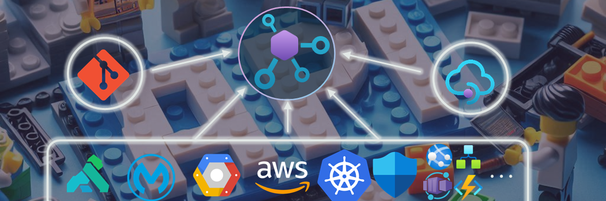

# API Center ❤️ all APIs

TODO: explain why we need API Center

## Universal API Center

TODO: This repo explores the ....

## 🧪 Labs

TODO: explain that powershell works on Windows and Linux and Juputer notebooks provide the playground to experiment the labs.

|  |  | | |
| ---- | ----- | ----------- | -- |
| [Import from generic OpenAPI](labs/import-from-generic-openapi/import-from-generic-openapi.ipynb) |  | Playground to experiment importing APIs in the OpenAPI specification using different methods provided by API Center. We start by creating an API Center instance using Bicep and then we will use the Azure CLI to import the APIs. | [💬](../../issues/11 "Discussion") |
| [Import from Azure API Management](labs/import-from-azure-apim/import-from-azure-apim.ipynb)     |  | Work in progress | [💬](../../issues/15 "Discussion") |
| [Import from Amazon API Gateway](labs/import-from-aws/import-from-aws.ipynb)     |  | Work in progress | [💬](../../issues/15 "Discussion") |
| [Import from Apigee](labs/import-from-gcp/import-from-gcp.ipynb)     |  | Work in progress | [💬](../../issues/15 "Discussion") |
| [Import from Kong](labs/import-from-kong/import-from-kong.ipynb)     |  | Work in progress | [💬](../../issues/15 "Discussion") |
| [Import from Mulesoft](labs/import-from-mulesoft/import-from-mulesoft.ipynb)     |  | Work in progress | [💬](../../issues/15 "Discussion") |
| [Import from Kubernetes](labs/import-from-k8s/import-from-k8s.ipynb)     |  | Work in progress | [💬](../../issues/15 "Discussion") |
| [Import from GitHub](labs/import-from-github/import-from-github.ipynb)     |  | Work in progress | [💬](../../issues/15 "Discussion") |

> [!TIP]
> Kindly use [the feedback discussion](../../discussions/9) so that we can continuously improve with your experiences, suggestions, ideas or lab requests.

## 🚀 Getting Started

### Prerequisites
- Install the latest [.NET 8 SDK](https://dotnet.microsoft.com/en-us/download)
- Install the latest [Visual Studio Code](https://code.visualstudio.com/)
- Install the [Polyglot Notebooks extension](https://marketplace.visualstudio.com/items?itemName=ms-dotnettools.dotnet-interactive-vscode) from the VS Code marketplace
- Install the latest [PowerShell](https://learn.microsoft.com/en-us/powershell/scripting/install/installing-powershell) installed
- Install the latest [Azure CLI](https://learn.microsoft.com/en-us/cli/azure/install-azure-cli)
- [An Azure Subscription](https://azure.microsoft.com/en-us/free/) with Contributor permissions
- [Sign in to Azure with Azure CLI](https://learn.microsoft.com/en-us/cli/azure/authenticate-azure-cli-interactively)

### Quickstart
1. Clone this repo and configure your local machine with the prerequisites. Or just create a [GitHub Codespace](https://codespaces.new/Azure-Samples/universal-api-center/tree/main) and run it on the browser or in VS Code.
2. Navigate through the available labs and select one that best suits your needs. For starters we recommend the [import from generic OpenAPI](labs/import-from-generic-openapi/import-from-generic-openapi.ipynb).
3. Open the notebook and run the provided steps.
4. Tailor the experiment according to your requirements. If you wish to contribute to our collective work, we would appreciate your [submission of a pull request](CONTRIBUTING.MD).

> [!NOTE]
> 🪲 Please feel free to open a new [issue](../../issues/new) if you find something that should be fixed or enhanced.

## 🥇 Other resources

- [API Center Overview video](https://www.youtube.com/watch?v=Y9K3Fx2TpCo)
- [Analyze your API Specs with Azure API Center](https://github.com/Azure/APICenter-Analyzer)
- [Govern SAP APIs living in various API Management gateways in a single place with Azure API Center](https://community.sap.com/t5/technology-blogs-by-members/govern-sap-apis-living-in-various-api-management-gateways-in-a-single-place/ba-p/13682483)

> We believe that there may be valuable content that we are currently unaware of. We would greatly appreciate any suggestions or recommendations to enhance this list.

## 🌐 WW GBB initiative

## Disclaimer
> [!IMPORTANT]
> This software is provided for demonstration purposes only. It is not intended to be relied upon for any purpose. The creators of this software make no representations or warranties of any kind, express or implied, about the completeness, accuracy, reliability, suitability or availability with respect to the software or the information, products, services, or related graphics contained in the software for any purpose. Any reliance you place on such information is therefore strictly at your own risk.