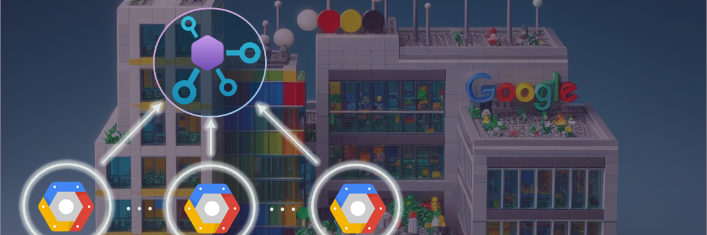

# API Center ❤️ all APIs

## Import from Apigee API Management 

Playground to experiment importing APIs from Apigee. We start by creating an API Center instance using [Bicep resource definition](https://learn.microsoft.com/en-us/azure/templates/microsoft.apicenter/services?pivots=deployment-language-bicep) and then we will use the [GCP CLI](https://cloud.google.com/sdk/docs/install-sdk) to export the Apigee APIs and the [Azure CLI](https://learn.microsoft.com/en-us/cli/azure/apic?view=azure-cli-latest) to import the APIs into API Center.

💡 Every step outlined below leverages the power of PowerShell scripts. This is designed so you can seamlessly integrate them into your automation workflows, CI/CD pipelines, webhooks, and more.

### Learning Objectives - Upon completing this lab, you should be able to:
- Deploy Azure API Center using Bicep.
- Import environments from Apigee
- Import APIs from Apigee
- Import API deployments from Apigee
- Search and discover the APIs registered in API Center.

### Prerequisites
- Install or update to the latest [.NET 8 SDK](https://dotnet.microsoft.com/en-us/download)
- Install or update to the latest [Visual Studio Code](https://code.visualstudio.com/)
- Install the [Polyglot Notebooks extension](https://marketplace.visualstudio.com/items?itemName=ms-dotnettools.dotnet-interactive-vscode) from the VS Code marketplace
- Install or update to the latest [PowerShell](https://learn.microsoft.com/en-us/powershell/scripting/install/installing-powershell)
- Install or update to the latest [Azure CLI](https://learn.microsoft.com/en-us/cli/azure/install-azure-cli). The Azure API Center extension will automatically install the first time you run an [az apic](https://learn.microsoft.com/en-us/cli/azure/apic?view=azure-cli-latest) command.
- [An Azure Subscription](https://azure.microsoft.com/en-us/free/) with Contributor permissions
- [Sign in to Azure with Azure CLI](https://learn.microsoft.com/en-us/cli/azure/authenticate-azure-cli-interactively)
- Install or update to the latest [GCP CLI](https://cloud.google.com/sdk/docs/install-sdk) and set your Apigee project
